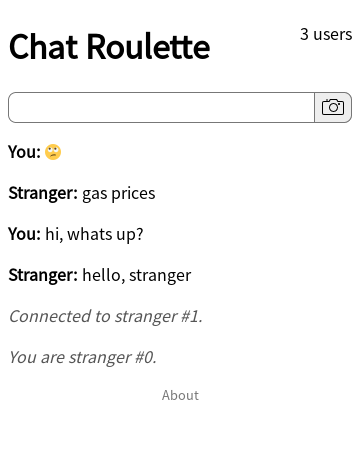

# Chat Roulette

This is a text-only chat roulette implementation in pure Kotlin, i.e., both backend and frontend are written in Kotlin. Build & run with `./gradlew run`. The application is up when the line `[main] INFO  ktor.application - Responding at http://0.0.0.0:8080` is logged.

Try it out at https://guarded-waters-49301.herokuapp.com/.

## Deploying to Heroku

To deploy to Heroku, apply the following configuration to the Heroku application: `heroku config:set GRADLE_TASK="installDist"`. This tells Heroku which Gradle task to run during deployment. The `installDist` task writes a self-contained version of the application to the directory `build/install/chat-roulette/`, which can then be started via `./build/install/chat-roulette/bin/chat-roulette`.
